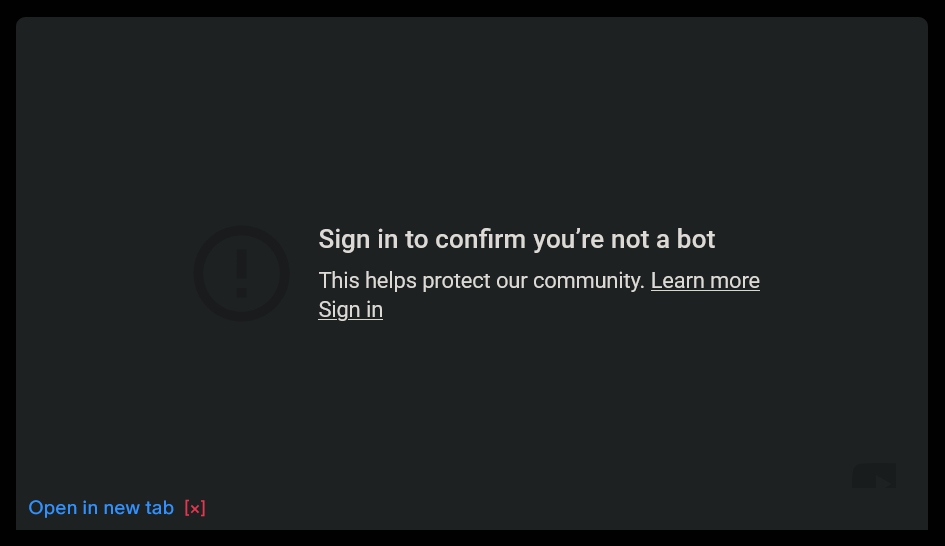

# YouTube-Embed-Links
Adds a link to each YouTube embed to open the video in a new tab, in case the "Sign in to confirm you're not a bot" message pops up.  
Should work on any page.

 

 

### [Click here to install the userscript](https://github.com/Sv443/YouTube-Embed-Links/raw/refs/heads/main/YouTube-Embed-Links.user.js)
Note: requires a userscript manager browser extension like [Violentmonkey](https://violentmonkey.github.io/), [FireMonkey](https://github.com/erosman/firemonkey) or [Tampermonkey](https://www.tampermonkey.net/).

 

Licensed under the [MIT license](./LICENSE).
